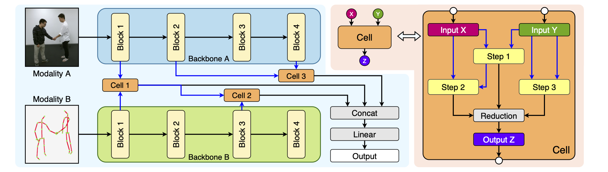
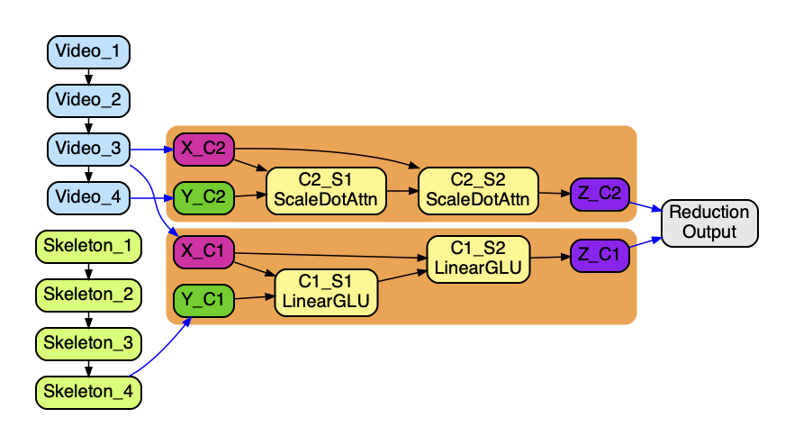

# BM-NAS: Bilevel Multimodal Neural Architecture Search (AAAI 2022 Oral)

Yihang Yin, Siyu Huang, Xiang Zhang

## Paper, Poster and Presentation



Please check our arXiv version [here](https://arxiv.org/abs/2104.09379) for the full paper with supplementary. We also provide our [poster](poster.pdf) in this repo. Our oral presentation video at AAAI-2022 can be found on YouTube, for both the [brief introduction](https://youtu.be/mP4u40Zkd4I) and the [full version](https://youtu.be/EGZu5bOi_M4).

## Requirements

The latest tested versions are:

```
pytorch==1.10.1
opencv-python==4.5.5.62
sklearn==1.10.1
tqdm
IPython
graphviz (you need excutebles, not only Python API)
```

## Pre-trained Backbones and Pre-processed Datasets

The backbones (checkpoints) and pre-processed datasets (BM-NAS_dataset) are available at [here](https://www.aliyundrive.com/s/CGxXMGRuTfJ), you can download them and put them in the root directory.
For some weird reason, ego checkpoints are blocked by AliCloud, There is an alternative Google Drive link for checkpoints at [here](https://drive.google.com/drive/folders/1GxcZXWnN6JP447q2fe5MtG-j3JWcgMbX?usp=sharing).
## MM-IMDB Experiments

You can just use our pre-processed dataset, but you should cite the original [MM-IMDB](https://github.com/johnarevalo/gmu-mmimdb) dataset. 

## Dataset Pre-processing

If you want to use the original one, you can follow these steps. 

You can download **multimodal_imdb.hdf5** from the original repo of [MM-IMDB](https://github.com/johnarevalo/gmu-mmimdb). Then use our pre-processing script to split the dataset.

```shell
$ python datasets/prepare_mmimdb.py
```

## Run Experiments

```shell
$ python main_darts_searchable_mmimdb.py
$ python main_darts_found_mmimdb.py --search_exp_dir=<dir of search exp>
```

## NTU RGB-D Experiments

You can just use our pre-processed dataset, but you should cite the original [NTU RGB-D](https://rose1.ntu.edu.sg/dataset/actionRecognition/) dataset. 

### Dataset Pre-processing

If you want to use the original one, you can follow these steps. 

First, request and download the NTU RGB+D dataset (not NTU RGB+D 120) from the official [site](https://rose1.ntu.edu.sg/dataset/actionRecognition/). We only use the **3D skeletons (body joints)** and **RGB videos** modality. 

Then, run the following script to reshape all RGB videos to 256x256 with 30 fps:
```shell
$ python datasets/prepare_ntu.py --dir=<dir of RGB videos>
```

### Run Experiments

First search the hypernets. You can use **--parallel** for data-parallel. The default setting will require about 128GB of GPU memeroy, you may adjust the **--batchsize** according to your budget. 

```shell
$ python main_darts_searchable_ntu.py --parallel
```

Then train the searched fusion network. You need to assign the searching experiment by **--search_exp_dir**.

```shell
$ python main_darts_found_ntu.py --search_exp_dir=<dir of search exp>
```

If you want to just run the test process (no training of the fusion network), you can also use this script, you need to assign both the searching and evaluation experiments directories.

```shell
$ python main_darts_found_ntu.py --search_exp_dir=<dir of search exp> --eval_exp_dir=<dir of eval exp>
```

## EgoGesture Experiments

First search the hypernets. You can use **--parallel** for data-parallel. You may adjust the **--batchsize** according to your GPU memory budget. 

```shell
$ python main_darts_searchable_ego.py --parallel
```

Then train the searched fusion network. You need to assign the searching experiment by **--search_exp_dir**.

```shell
$ python main_darts_found_ego.py --search_exp_dir=<dir of search exp>
```

If you want to just run the test process (no training of the fusion network), you can also use this script, you need to assign both the searching and evaluation experiments directories.

```shell
$ python main_darts_found_ego.py --search_exp_dir=<dir of search exp> --eval_exp_dir=<dir of eval exp>
```

## Visualization

You can use **structure_vis.ipynb** to visualize the searched genotypes.



## Citation

If you find this work helpful, please kindly cite our [paper](https://arxiv.org/abs/2104.09379).

```latex
@article{yin2021bm,
  title={BM-NAS: Bilevel Multimodal Neural Architecture Search},
  author={Yin, Yihang and Huang, Siyu and Zhang, Xiang},
  journal={arXiv preprint arXiv:2104.09379},
  year={2021}
}
```

